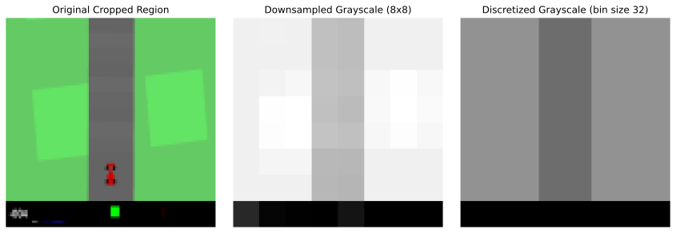
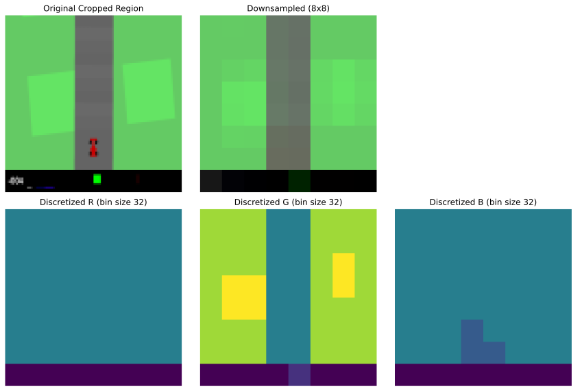
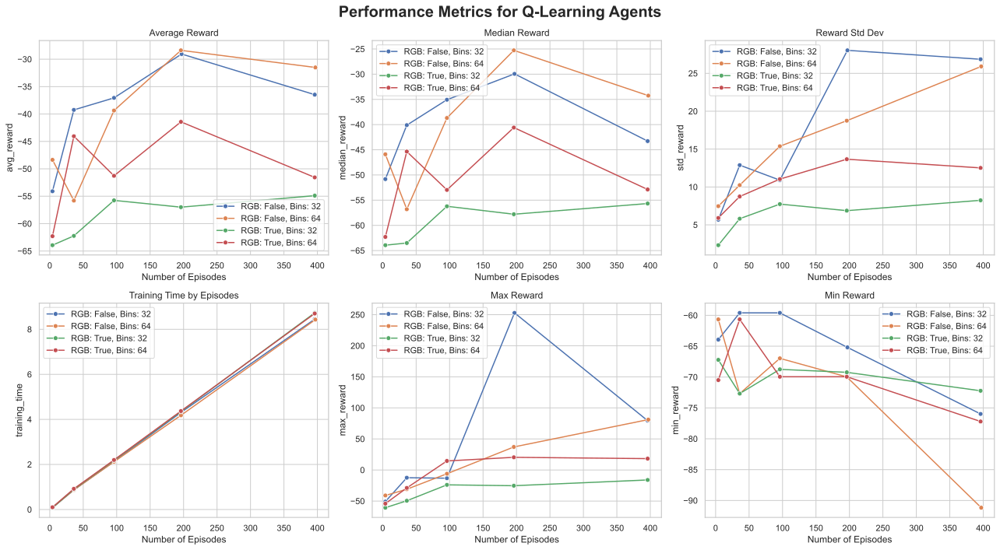
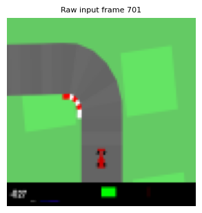
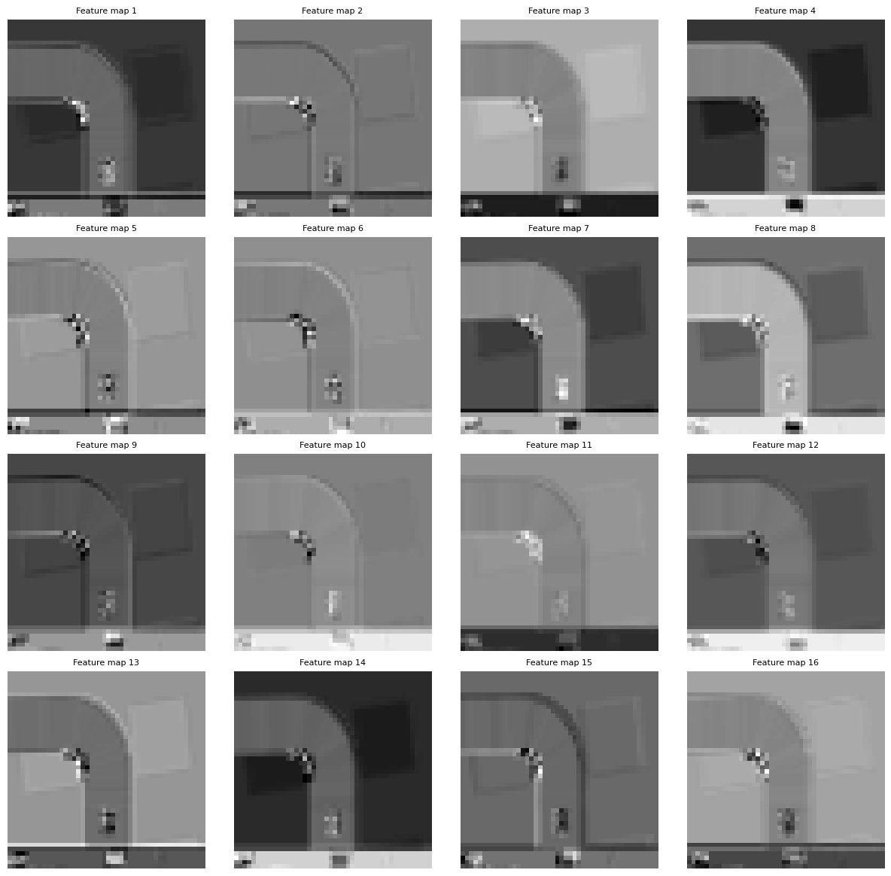
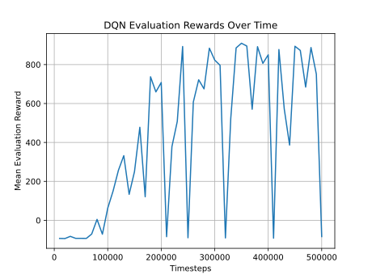

<h1 align="center">🏁 Car Racing 🏎️ — Reinforcement Learning Project 🏎️</h1>
<h2 align="center">Final Project – Autonomous Driving with RL</h2>

<p align="center">
  <b>Ferran Boada Bergadà, Julian Romero & Simon Vellin</b>
</p>

<p align="center">
  
  
  
  
  
  
</p>

---

## 🚀 Overview

This project applies **Reinforcement Learning (RL)** techniques to a simulated autonomous car driving task using OpenAI’s **CarRacing-v3** environment.  
We implement and compare two value-based RL approaches:

- **Tabular Q-Learning**  
- **Deep Q-Learning (DQN)**

Both models operate on a **discrete action space**:  
**`[do nothing, steer left, steer right, accelerate, brake]`**

---

## 🧠 RL Methods

### 📊 Tabular Q-Learning – State-Action Approach

We discretize each `96×96×3` frame into an `8×8` grid, converting to grayscale or RGB with 32/64 bin quantization. A Q-table is updated using the Bellman equation and ε-greedy policy (ε from 1.0 → 0.1), across 1,000–100,000 episodes.

#### 🖼️ State Representation (Discretization)

**Grayscale Discretization**  


**RGB Discretization**  


#### 📈 Model Performance


#### 🏎️ Agent in Action


---

### 🤖 Deep Q-Learning (DQN) – CNN-Based Approach

We use **Stable-Baselines3’s DQN** with a convolutional neural network (CNN) policy that maps raw pixel observations to Q-values.  
The agent is trained using:
- **4-frame stacking** (`VecFrameStack`)
- **Parallel environments** (`SubprocVecEnv`)
- **Replay buffer** of 50,000
- **Learning rate**: 3×10⁻⁴  
- **ε-greedy decay** from 1.0 → 0.05 over the first 20% of training  
- **Target network updates** every 1,000 steps  
- **Training steps**: 200,000

#### 🧠 CNN Feature Maps (First Layer Output)

Raw input vs first CNN features:




#### 📈 Model Performance


#### 🏎️ Agent in Action


---

## 📁 Repository Structure

```text
├── dqn_learning  
│   ├── training.py               # DQN training script using SB3  
│  
├── tabular_q_learning
│   ├── agents.py                 # Q-learning agent and discretization  
│   ├── experiments.py            # Experiment config runner  
│   ├── results_analysis.ipynb    # Jupyter for metrics & plots  
│   ├── training.py               # Training loop  
│   ├── results                   # Images, SVGs, and GIFs  
│   └── utils.py                  # Plotting, JSON utils, etc.
```
---
## Environment Setup

We use [uv](https://docs.astral.sh/uv/) for environment management. To run the 

```bash
# Install uv for Python environment management
curl -LsSf https://astral.sh/uv/install.sh | sh

# Create and sync the environment from pyproject.toml
uv sync

# Activate environment
source .venv/bin/activate

#Run scripts
python dqn_learning/training.py
python tabular_q_learning/training.py
```